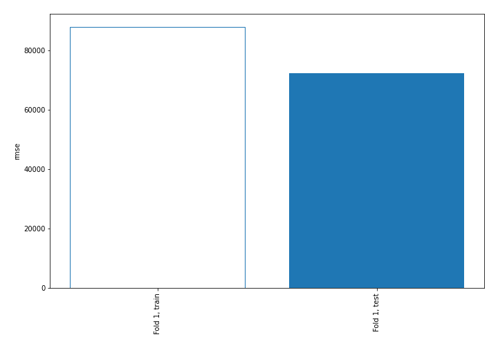
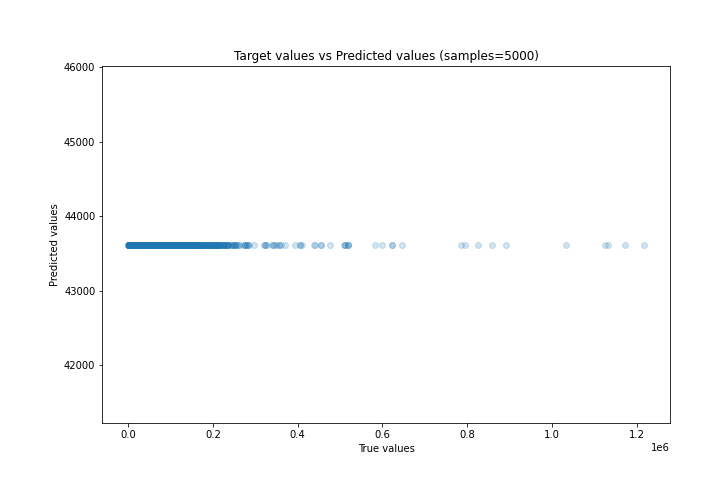
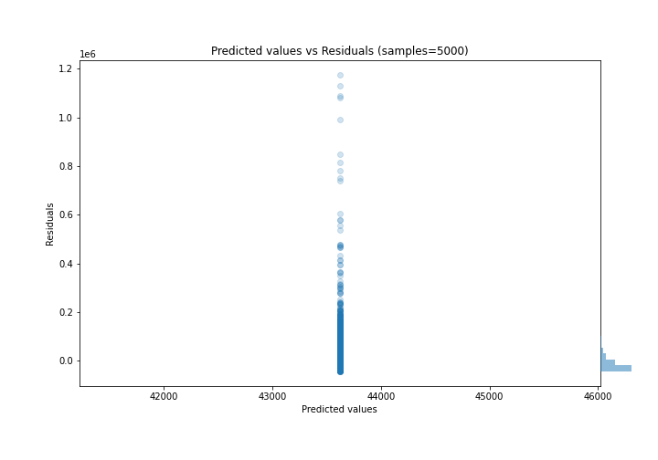

# Summary of 1_Baseline

[<< Go back](../README.md)

## Baseline Regressor (Baseline)
- **n_jobs**: -1
- **explain_level**: 2

## Validation
 - **validation_type**: split
 - **train_ratio**: 0.75
 - **shuffle**: True

## Optimized metric
rmse

## Training time

1.0 seconds

### Metric details:
| Metric   |           Score |
|:---------|----------------:|
| MAE      | 35357.2         |
| MSE      |     5.2391e+09  |
| RMSE     | 72381.7         |
| R2       |    -9.90929e-05 |
| MAPE     |     9.60904     |

## Learning curves

## True vs Predicted

## Predicted vs Residuals

[<< Go back](../README.md)
