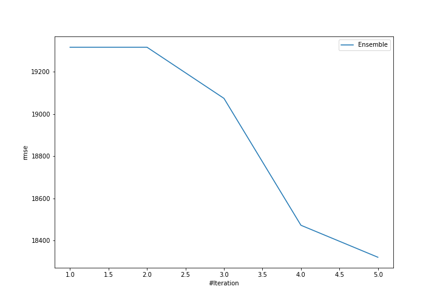
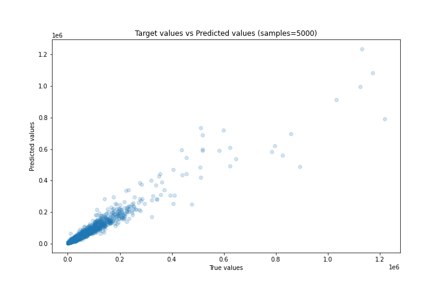
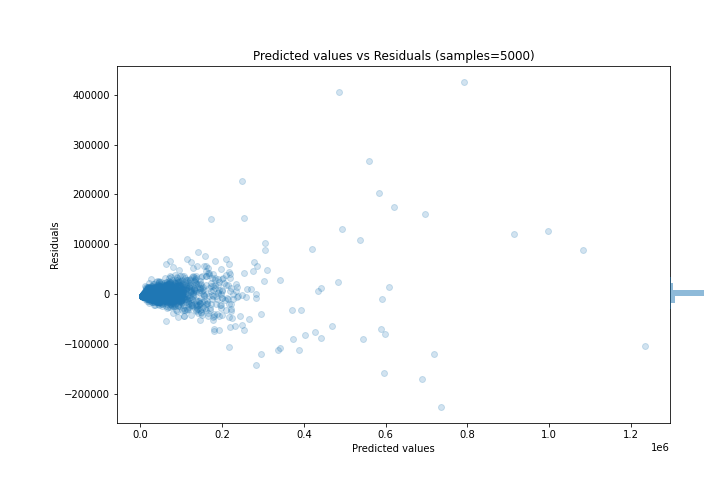

# Summary of Ensemble

[<< Go back](../README.md)

## Ensemble structure
| Model             |   Weight |
|:------------------|---------:|
| 2_DecisionTree    |        1 |
| 3_Default_Xgboost |        4 |

### Metric details:
| Metric   |          Score |
|:---------|---------------:|
| MAE      |  6566.4        |
| MSE      |     3.3566e+08 |
| RMSE     | 18321          |
| R2       |     0.935925   |
| MAPE     |     0.978213   |

## Learning curves

## True vs Predicted

## Predicted vs Residuals

[<< Go back](../README.md)
