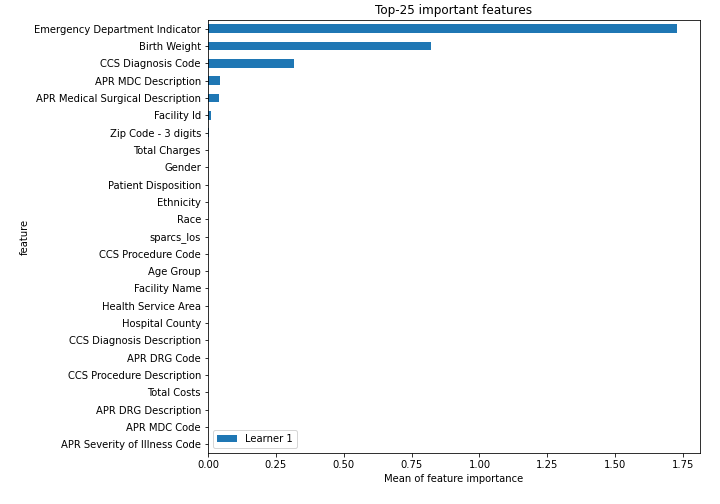

# Summary of 2_DecisionTree

[<< Go back](../README.md)

## Decision Tree
- **n_jobs**: -1
- **criterion**: gini
- **max_depth**: 3
- **num_class**: 6
- **explain_level**: 2

## Validation
 - **validation_type**: split
 - **train_ratio**: 0.75
 - **shuffle**: True
 - **stratify**: True

## Optimized metric
logloss

## Training time

31.0 seconds

### Metric details
|           |   Elective |   Emergency |    Newborn |   Not Available |   Trauma |      Urgent |   accuracy |   macro avg |   weighted avg |   logloss |
|:----------|-----------:|------------:|-----------:|----------------:|---------:|------------:|-----------:|------------:|---------------:|----------:|
| precision |   0.595668 |    0.974874 |   0.990698 |               0 |        0 |   0.727273  |   0.856465 |    0.548085 |       0.881928 |  0.378191 |
| recall    |   0.976331 |    0.898468 |   0.995327 |               0 |        0 |   0.0489297 |   0.856465 |    0.486509 |       0.856465 |  0.378191 |
| f1-score  |   0.73991  |    0.935113 |   0.993007 |               0 |        0 |   0.0916905 |   0.856465 |    0.459953 |       0.837495 |  0.378191 |
| support   | 845        | 2807        | 428        |               5 |       12 | 327         |   0.856465 | 4424        |    4424        |  0.378191 |

## Confusion matrix
|                          |   Predicted as Elective |   Predicted as Emergency |   Predicted as Newborn |   Predicted as Not Available |   Predicted as Trauma |   Predicted as Urgent |
|:-------------------------|------------------------:|-------------------------:|-----------------------:|-----------------------------:|----------------------:|----------------------:|
| Labeled as Elective      |                     825 |                       18 |                      0 |                            0 |                     0 |                     2 |
| Labeled as Emergency     |                     280 |                     2522 |                      2 |                            0 |                     0 |                     3 |
| Labeled as Newborn       |                       0 |                        1 |                    426 |                            0 |                     0 |                     1 |
| Labeled as Not Available |                       0 |                        5 |                      0 |                            0 |                     0 |                     0 |
| Labeled as Trauma        |                       3 |                        9 |                      0 |                            0 |                     0 |                     0 |
| Labeled as Urgent        |                     277 |                       32 |                      2 |                            0 |                     0 |                    16 |

## Learning curves

## Decision Tree 

### Tree #1

### Rules

if (Emergency Department Indicator > 0.5) and (APR MDC Description <= 22.5) and (Zip Code - 3 digits <= 27.5) then class: Emergency (proba: 98.89%) | based on 5,501 samples

if (Emergency Department Indicator <= 0.5) and (Birth Weight <= 250.0) and (APR Medical Surgical Description <= 0.5) then class: Elective (proba: 41.6%) | based on 2,238 samples

if (Emergency Department Indicator <= 0.5) and (Birth Weight <= 250.0) and (APR Medical Surgical Description > 0.5) then class: Elective (proba: 76.89%) | based on 2,012 samples

if (Emergency Department Indicator > 0.5) and (APR MDC Description <= 22.5) and (Zip Code - 3 digits > 27.5) then class: Emergency (proba: 96.56%) | based on 1,746 samples

if (Emergency Department Indicator <= 0.5) and (Birth Weight > 250.0) and (CCS Diagnosis Code <= 220.0) then class: Newborn (proba: 99.07%) | based on 1,296 samples

if (Emergency Department Indicator > 0.5) and (APR MDC Description > 22.5) and (Facility Id <= 1716.0) then class: Emergency (proba: 85.19%) | based on 432 samples

if (Emergency Department Indicator > 0.5) and (APR MDC Description > 22.5) and (Facility Id > 1716.0) then class: Urgent (proba: 84.85%) | based on 33 samples

if (Emergency Department Indicator <= 0.5) and (Birth Weight > 250.0) and (CCS Diagnosis Code > 220.0) then class: Urgent (proba: 53.85%) | based on 13 samples

## Permutation-based Importance

## Confusion Matrix

## Normalized Confusion Matrix

## ROC Curve

## Precision Recall Curve

## SHAP Importance

## SHAP Dependence plots

### Dependence Elective (Fold 1)

### Dependence Emergency (Fold 1)

### Dependence Newborn (Fold 1)

### Dependence Not Available (Fold 1)

### Dependence Trauma (Fold 1)

### Dependence Urgent (Fold 1)

## SHAP Decision plots

### Worst decisions for selected sample 1 (Fold 1)

### Worst decisions for selected sample 2 (Fold 1)

### Worst decisions for selected sample 3 (Fold 1)

### Worst decisions for selected sample 4 (Fold 1)

### Best decisions for selected sample 1 (Fold 1)

### Best decisions for selected sample 2 (Fold 1)

### Best decisions for selected sample 3 (Fold 1)

### Best decisions for selected sample 4 (Fold 1)

[<< Go back](../README.md)
