# Summary of 3_Default_Xgboost

[<< Go back](../README.md)

## Extreme Gradient Boosting (Xgboost)
- **n_jobs**: -1
- **objective**: multi:softprob
- **eta**: 0.075
- **max_depth**: 6
- **min_child_weight**: 1
- **subsample**: 1.0
- **colsample_bytree**: 1.0
- **eval_metric**: mlogloss
- **num_class**: 6
- **explain_level**: 2

## Validation
 - **validation_type**: split
 - **train_ratio**: 0.75
 - **shuffle**: True
 - **stratify**: True

## Optimized metric
logloss

## Training time

66.6 seconds

### Metric details
|           |   Elective |   Emergency |    Newborn |   Not Available |   Trauma |     Urgent |   accuracy |   macro avg |   weighted avg |   logloss |
|:----------|-----------:|------------:|-----------:|----------------:|---------:|-----------:|-----------:|------------:|---------------:|----------:|
| precision |   0.826797 |    0.961089 |   0.993023 |        1        |     1    |   0.768595 |   0.925859 |    0.924918 |       0.92445  |  0.222508 |
| recall    |   0.898225 |    0.967937 |   0.997664 |        0.8      |     0.25 |   0.568807 |   0.925859 |    0.747106 |       0.925859 |  0.222508 |
| f1-score  |   0.861032 |    0.964501 |   0.995338 |        0.888889 |     0.4  |   0.653779 |   0.925859 |    0.793923 |       0.923138 |  0.222508 |
| support   | 845        | 2807        | 428        |        5        |    12    | 327        |   0.925859 | 4424        |    4424        |  0.222508 |

## Confusion matrix
|                          |   Predicted as Elective |   Predicted as Emergency |   Predicted as Newborn |   Predicted as Not Available |   Predicted as Trauma |   Predicted as Urgent |
|:-------------------------|------------------------:|-------------------------:|-----------------------:|-----------------------------:|----------------------:|----------------------:|
| Labeled as Elective      |                     759 |                       52 |                      0 |                            0 |                     0 |                    34 |
| Labeled as Emergency     |                      66 |                     2717 |                      2 |                            0 |                     0 |                    22 |
| Labeled as Newborn       |                       1 |                        0 |                    427 |                            0 |                     0 |                     0 |
| Labeled as Not Available |                       0 |                        1 |                      0 |                            4 |                     0 |                     0 |
| Labeled as Trauma        |                       0 |                        9 |                      0 |                            0 |                     3 |                     0 |
| Labeled as Urgent        |                      92 |                       48 |                      1 |                            0 |                     0 |                   186 |

## Learning curves
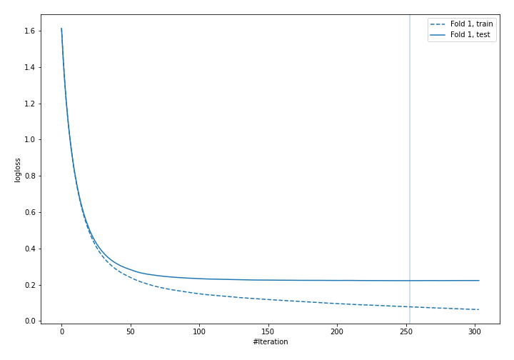

## Permutation-based Importance
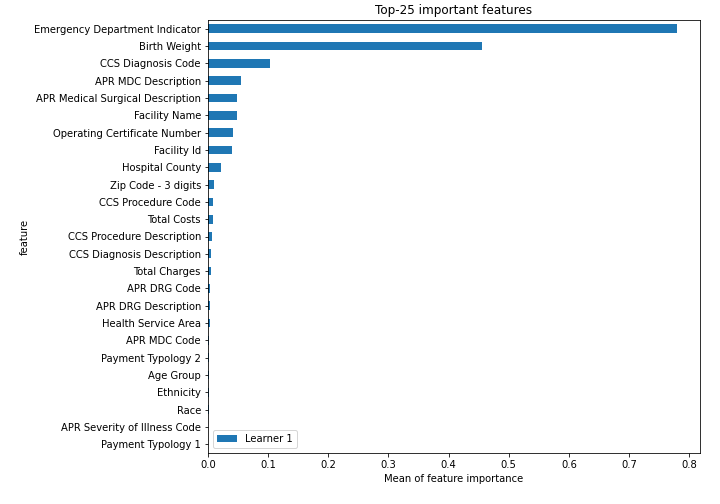
## Confusion Matrix

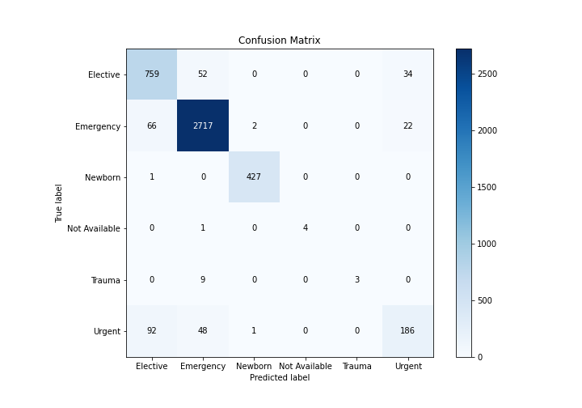

## Normalized Confusion Matrix

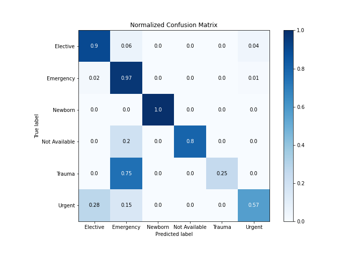

## ROC Curve

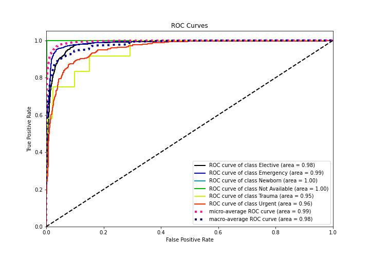

## Precision Recall Curve

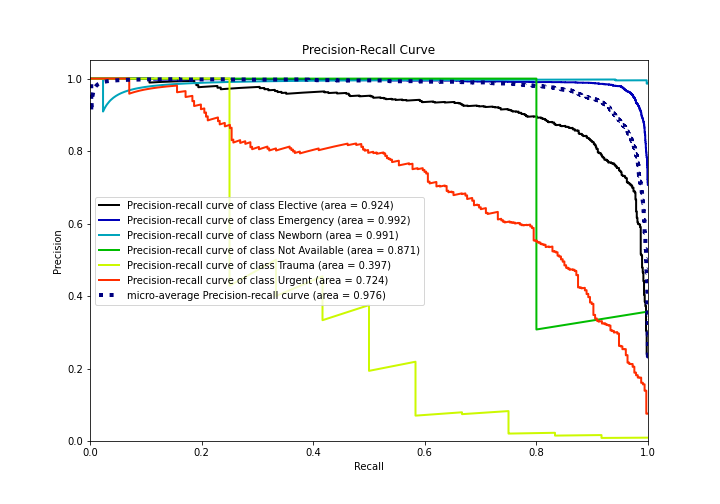

## SHAP Importance
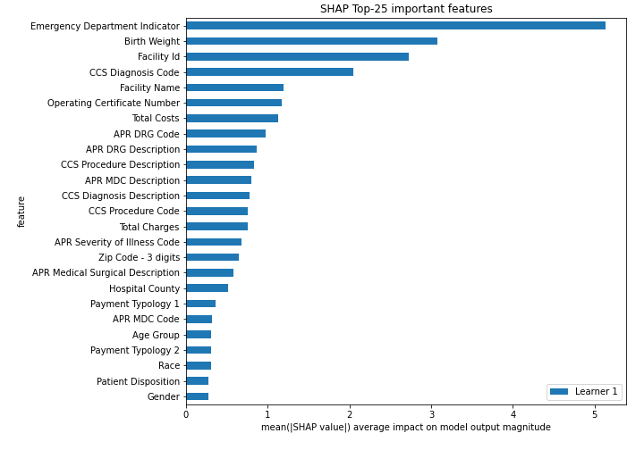

## SHAP Dependence plots

### Dependence Elective (Fold 1)
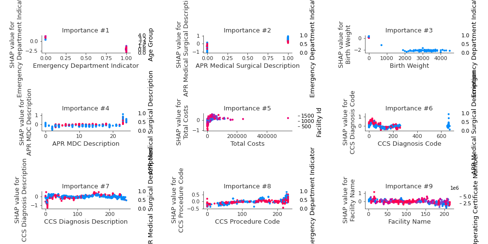
### Dependence Emergency (Fold 1)
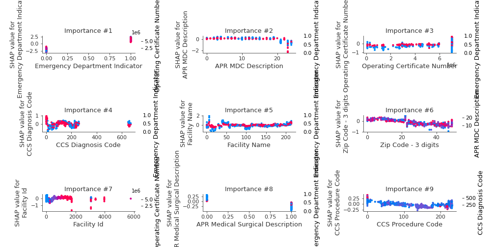
### Dependence Newborn (Fold 1)
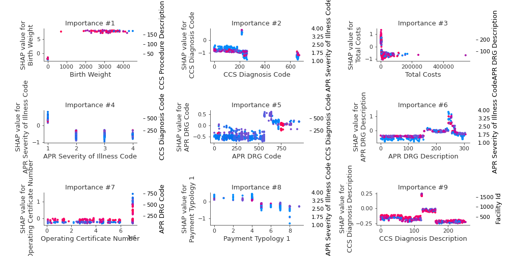
### Dependence Not Available (Fold 1)

### Dependence Trauma (Fold 1)
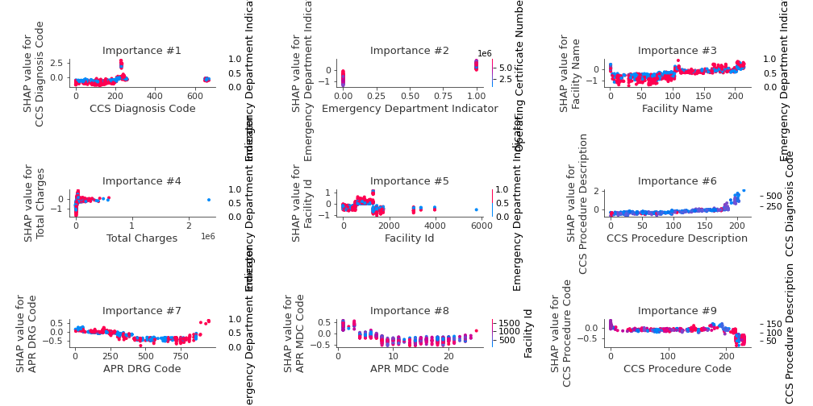
### Dependence Urgent (Fold 1)
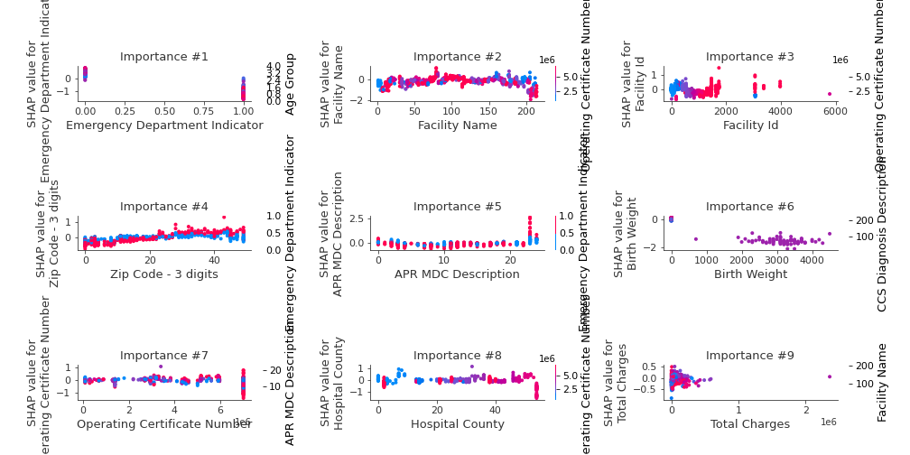

## SHAP Decision plots

### Worst decisions for selected sample 1 (Fold 1)

### Worst decisions for selected sample 2 (Fold 1)
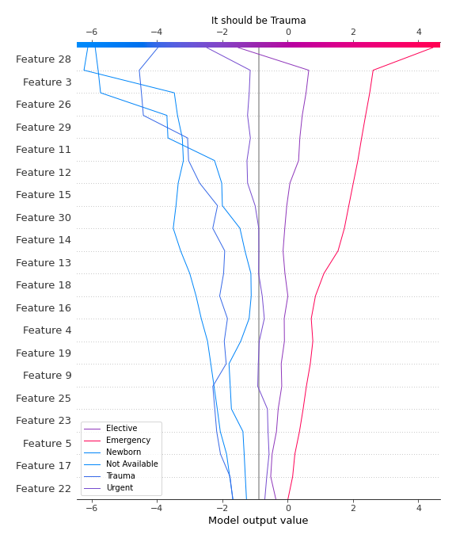
### Worst decisions for selected sample 3 (Fold 1)
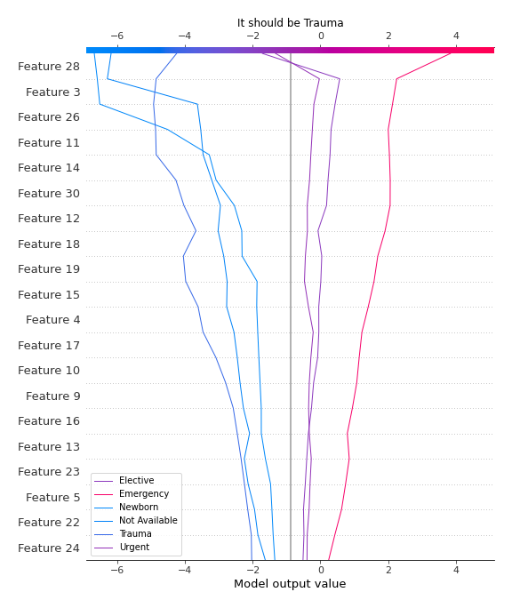
### Worst decisions for selected sample 4 (Fold 1)
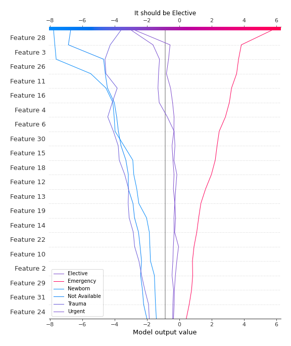
### Best decisions for selected sample 1 (Fold 1)
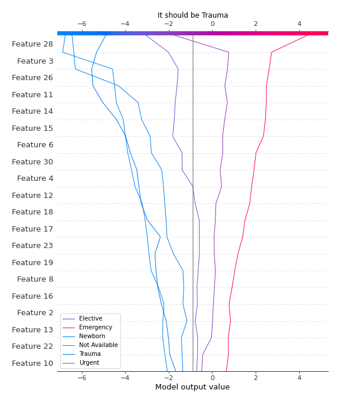
### Best decisions for selected sample 2 (Fold 1)
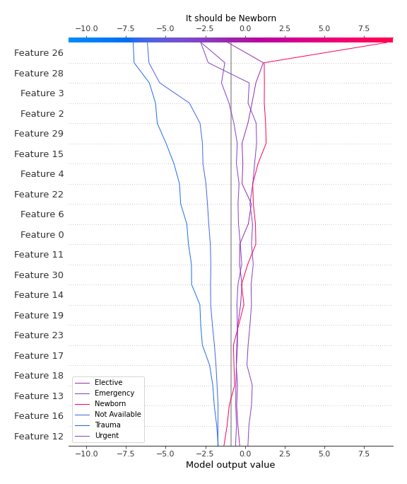
### Best decisions for selected sample 3 (Fold 1)
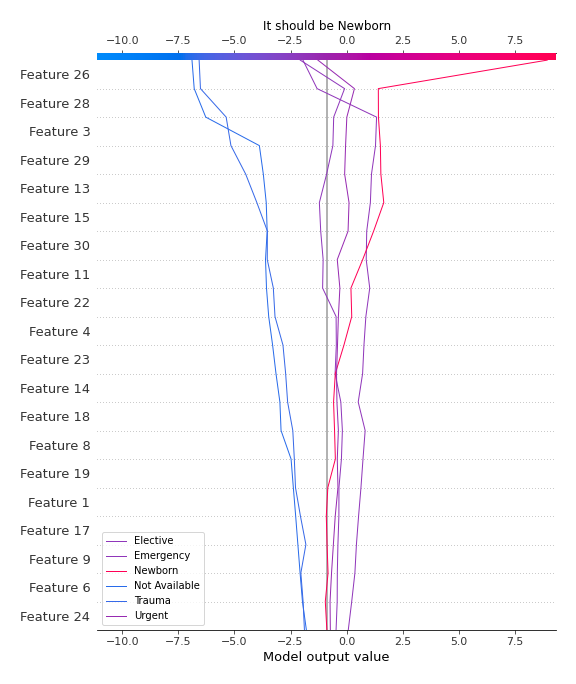
### Best decisions for selected sample 4 (Fold 1)

[<< Go back](../README.md)
