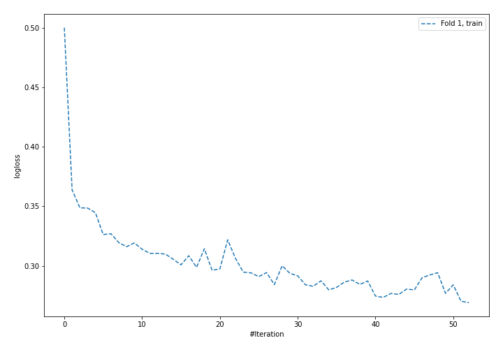
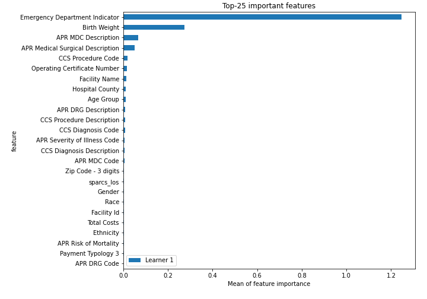
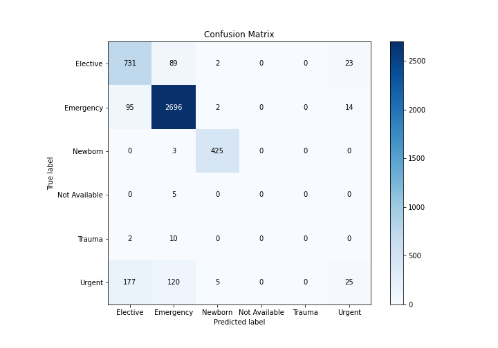
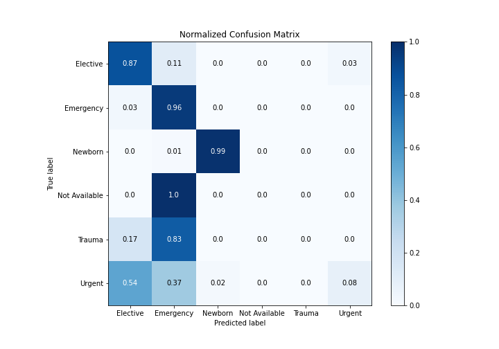
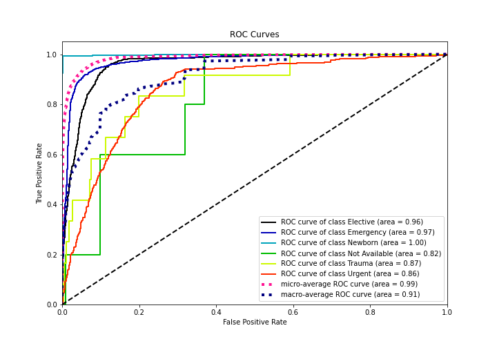
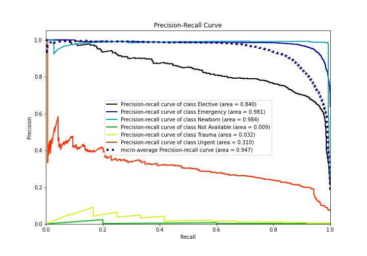

# Summary of 4_Default_NeuralNetwork

[<< Go back](../README.md)

## Neural Network
- **n_jobs**: -1
- **dense_1_size**: 32
- **dense_2_size**: 16
- **learning_rate**: 0.05
- **num_class**: 6
- **explain_level**: 2

## Validation
 - **validation_type**: split
 - **train_ratio**: 0.75
 - **shuffle**: True
 - **stratify**: True

## Optimized metric
logloss

## Training time

7.7 seconds

### Metric details
|           |   Elective |   Emergency |    Newborn |   Not Available |   Trauma |      Urgent |   accuracy |   macro avg |   weighted avg |   logloss |
|:----------|-----------:|------------:|-----------:|----------------:|---------:|------------:|-----------:|------------:|---------------:|----------:|
| precision |   0.727363 |    0.92234  |   0.979263 |               0 |        0 |   0.403226  |   0.876356 |    0.505365 |       0.848691 |  0.359378 |
| recall    |   0.865089 |    0.960456 |   0.992991 |               0 |        0 |   0.0764526 |   0.876356 |    0.482498 |       0.876356 |  0.359378 |
| f1-score  |   0.79027  |    0.941012 |   0.986079 |               0 |        0 |   0.128535  |   0.876356 |    0.474316 |       0.85291  |  0.359378 |
| support   | 845        | 2807        | 428        |               5 |       12 | 327         |   0.876356 | 4424        |    4424        |  0.359378 |

## Confusion matrix
|                          |   Predicted as Elective |   Predicted as Emergency |   Predicted as Newborn |   Predicted as Not Available |   Predicted as Trauma |   Predicted as Urgent |
|:-------------------------|------------------------:|-------------------------:|-----------------------:|-----------------------------:|----------------------:|----------------------:|
| Labeled as Elective      |                     731 |                       89 |                      2 |                            0 |                     0 |                    23 |
| Labeled as Emergency     |                      95 |                     2696 |                      2 |                            0 |                     0 |                    14 |
| Labeled as Newborn       |                       0 |                        3 |                    425 |                            0 |                     0 |                     0 |
| Labeled as Not Available |                       0 |                        5 |                      0 |                            0 |                     0 |                     0 |
| Labeled as Trauma        |                       2 |                       10 |                      0 |                            0 |                     0 |                     0 |
| Labeled as Urgent        |                     177 |                      120 |                      5 |                            0 |                     0 |                    25 |

## Learning curves

## Permutation-based Importance

## Confusion Matrix

## Normalized Confusion Matrix

## ROC Curve

## Precision Recall Curve

[<< Go back](../README.md)
