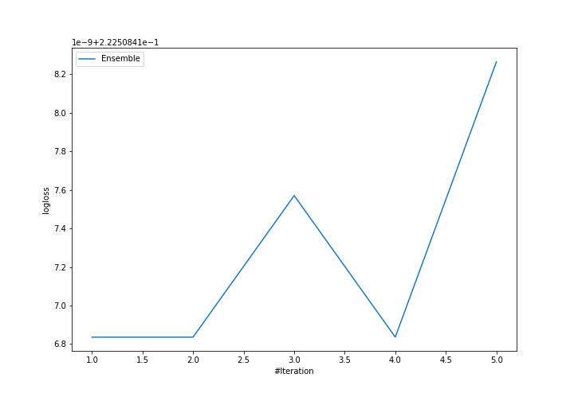
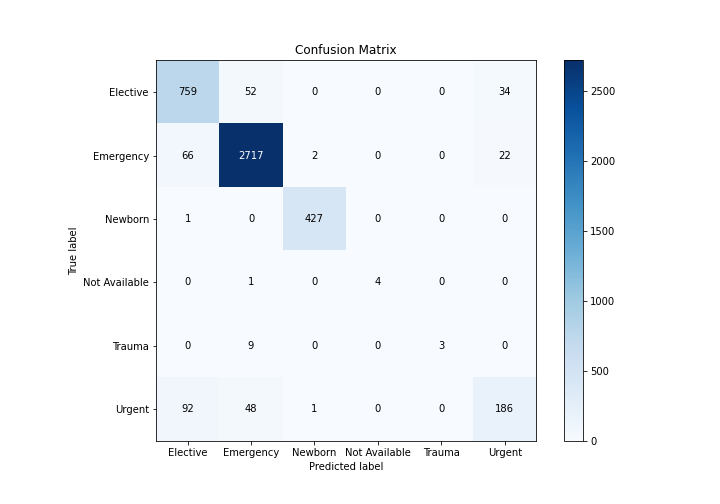
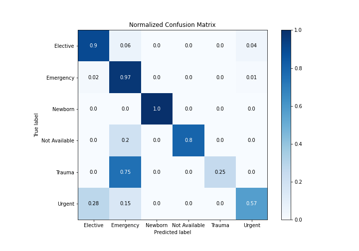
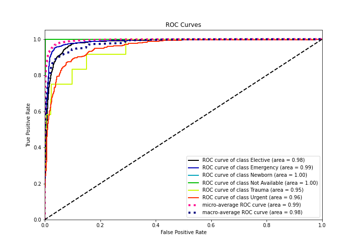
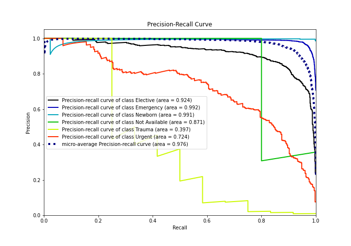

# Summary of Ensemble

[<< Go back](../README.md)

## Ensemble structure
| Model             |   Weight |
|:------------------|---------:|
| 3_Default_Xgboost |        1 |

### Metric details
|           |   Elective |   Emergency |    Newborn |   Not Available |   Trauma |     Urgent |   accuracy |   macro avg |   weighted avg |   logloss |
|:----------|-----------:|------------:|-----------:|----------------:|---------:|-----------:|-----------:|------------:|---------------:|----------:|
| precision |   0.826797 |    0.961089 |   0.993023 |        1        |     1    |   0.768595 |   0.925859 |    0.924918 |       0.92445  |  0.222508 |
| recall    |   0.898225 |    0.967937 |   0.997664 |        0.8      |     0.25 |   0.568807 |   0.925859 |    0.747106 |       0.925859 |  0.222508 |
| f1-score  |   0.861032 |    0.964501 |   0.995338 |        0.888889 |     0.4  |   0.653779 |   0.925859 |    0.793923 |       0.923138 |  0.222508 |
| support   | 845        | 2807        | 428        |        5        |    12    | 327        |   0.925859 | 4424        |    4424        |  0.222508 |

## Confusion matrix
|                          |   Predicted as Elective |   Predicted as Emergency |   Predicted as Newborn |   Predicted as Not Available |   Predicted as Trauma |   Predicted as Urgent |
|:-------------------------|------------------------:|-------------------------:|-----------------------:|-----------------------------:|----------------------:|----------------------:|
| Labeled as Elective      |                     759 |                       52 |                      0 |                            0 |                     0 |                    34 |
| Labeled as Emergency     |                      66 |                     2717 |                      2 |                            0 |                     0 |                    22 |
| Labeled as Newborn       |                       1 |                        0 |                    427 |                            0 |                     0 |                     0 |
| Labeled as Not Available |                       0 |                        1 |                      0 |                            4 |                     0 |                     0 |
| Labeled as Trauma        |                       0 |                        9 |                      0 |                            0 |                     3 |                     0 |
| Labeled as Urgent        |                      92 |                       48 |                      1 |                            0 |                     0 |                   186 |

## Learning curves

## Confusion Matrix

## Normalized Confusion Matrix

## ROC Curve

## Precision Recall Curve

[<< Go back](../README.md)
